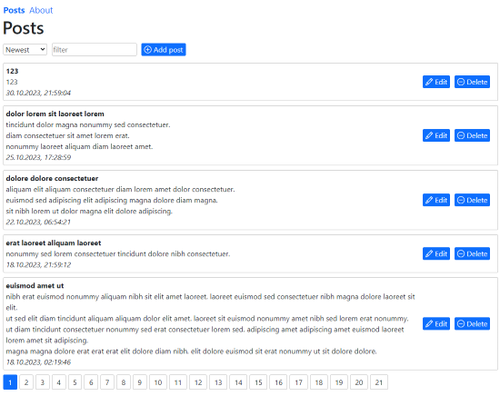

## Creating project

In Visual Studio 2022 create a new project from 'ASP.NET Core with React.js' (no authentication, uncheck https).  
Application has started, react is working, data is fetching.  

## Release publication

In index.js added a trailing slash in url.   
In ClientApp folder add .env.production file with PUBLIC_URL variable.  
Publish project to folder.  
Install dotnet-hosting bundle.  
In IIS create pool (no managed code), add application (Alias set to PUBLIC_URL, select folder).  
The site opens and works.  

## Server application

Add nuget package for file logging (for example, NLog.Web.AspNetCore).  
Create logger config, add initialization code in Program.cs.  

## Client application

Create react application and controller for it.  
It is a blog application.

ClientApp hierarchy: App -> Pages -> Components -> UI elements.

